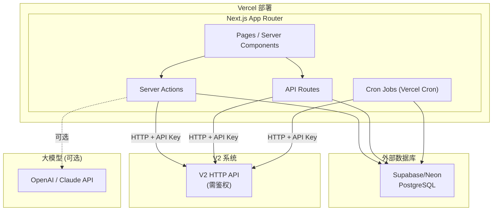

# 运单全流程管理系统 V3 — 技术方案设计

---

## 一、技术架构



### 技术选型

| 层级 | 选型 | 理由 |
|------|------|------|
| 框架 | Next.js 14+ App Router | 考试要求，延续 V2 |
| 语言 | TypeScript 5.x | 类型安全 |
| 数据库 | Supabase PostgreSQL | 免费额度 + 完善 API |
| ORM | Drizzle ORM | 轻量 + 类型安全 |
| UI 组件 | Tailwind CSS + shadcn/ui | 定制灵活 + 风格统一 |
| 表单验证 | Zod | 类型推导 + 前后端复用 |
| 部署 | Vercel | 考试要求 |
| 定时任务 | Vercel Cron Jobs | 超时自动流转 |
| 大模型 | OpenAI API (可选) | AI 辅助判断 |

---

## 二、数据库表结构设计

### 2.1 运单本地快照表 `waybill_snapshots`

```sql
CREATE TABLE waybill_snapshots (
  id              SERIAL PRIMARY KEY,
  waybill_no      VARCHAR(50)   NOT NULL UNIQUE,           -- 运单号（关联 V2）
  sender_info     JSONB,                                   -- 发件人信息摘要
  receiver_info   JSONB,                                   -- 收件人信息摘要
  amount          DECIMAL(12,2),                           -- 运单金额
  sku_list        JSONB,                                   -- SKU 明细快照
  v2_version      INTEGER       DEFAULT 1,                 -- V2 数据版本号
  sync_source     VARCHAR(20)   NOT NULL DEFAULT 'api',    -- api | manual
  synced_at       TIMESTAMPTZ   NOT NULL,                  -- 最近同步时间
  created_at      TIMESTAMPTZ   NOT NULL DEFAULT NOW(),
  updated_at      TIMESTAMPTZ   NOT NULL DEFAULT NOW()
);
CREATE INDEX idx_ws_waybill_no ON waybill_snapshots(waybill_no);
CREATE INDEX idx_ws_synced_at ON waybill_snapshots(synced_at);
```

### 2.2 扫描记录表 `scan_records`

```sql
CREATE TABLE scan_records (
  id              SERIAL PRIMARY KEY,
  scan_id         UUID          NOT NULL UNIQUE DEFAULT gen_random_uuid(),  -- 扫描唯一 ID
  waybill_no      VARCHAR(50)   NOT NULL,                  -- 关联运单号
  sku_code        VARCHAR(100)  NOT NULL,                  -- SKU 编码
  batch_no        VARCHAR(100),                            -- 批次号
  qty_scanned     INTEGER       NOT NULL,                  -- 扫描数量
  qty_expected    INTEGER,                                 -- 预期数量
  is_defective    BOOLEAN       DEFAULT FALSE,             -- 是否有外观破损
  defect_level    INTEGER,                                 -- 破损等级 1-5
  spec_deviation  TEXT,                                    -- 规格偏差描述
  qc_result       VARCHAR(20)   NOT NULL DEFAULT 'pending', -- pass / hold / pending
  qc_rule_hit_id  INTEGER,                                 -- 命中的品控规则 ID
  qc_reason       TEXT,                                    -- 品控判定依据
  batch_locked    BOOLEAN       NOT NULL DEFAULT FALSE,    -- 批次是否锁定
  ticket_id       INTEGER,                                 -- 关联的工单 ID (异常时非空)
  operator_id     VARCHAR(50)   NOT NULL,                  -- 扫描操作人 ID
  device_id       VARCHAR(100),                            -- 设备 ID
  scanned_at      TIMESTAMPTZ   NOT NULL DEFAULT NOW(),
  created_at      TIMESTAMPTZ   NOT NULL DEFAULT NOW()
);
CREATE INDEX idx_sr_ticket_id ON scan_records(ticket_id);
CREATE INDEX idx_sr_waybill_sku ON scan_records(waybill_no, sku_code);
CREATE INDEX idx_sr_batch_locked ON scan_records(batch_locked) WHERE batch_locked = TRUE;
```

### 2.3 品控规则表 `qc_rules`

```sql
CREATE TABLE qc_rules (
  id              SERIAL PRIMARY KEY,
  rule_code       VARCHAR(50)   NOT NULL UNIQUE,           -- 规则编码
  rule_name       VARCHAR(200)  NOT NULL,                  -- 规则名称
  exception_type  VARCHAR(50)   NOT NULL,                  -- 异常子类型：qty_diff / defect / spec_diff / label_err / batch_err
  condition_config JSONB        NOT NULL,                  -- 触发条件配置（阈值等）
  severity        VARCHAR(20)   NOT NULL DEFAULT 'minor',  -- minor / major / critical
  auto_create_ticket BOOLEAN    NOT NULL DEFAULT TRUE,     -- 是否自动创建工单
  default_approval_level INTEGER NOT NULL DEFAULT 2,       -- 默认进入的审批层级
  is_active       BOOLEAN       NOT NULL DEFAULT TRUE,
  description     TEXT,
  created_at      TIMESTAMPTZ   NOT NULL DEFAULT NOW(),
  updated_at      TIMESTAMPTZ   NOT NULL DEFAULT NOW()
);

-- 示例数据：数量差异规则
-- condition_config: { "qty_diff_percent": 5, "operator": ">=" }
-- 即数量差异 >= 5% 触发此规则
```

### 2.4 异常工单表 `exception_tickets`

```sql
CREATE TABLE exception_tickets (
  id              SERIAL PRIMARY KEY,
  ticket_no       VARCHAR(50)   NOT NULL UNIQUE,           -- 工单号（格式化: ET-YYYYMMDD-XXXX）
  waybill_no      VARCHAR(50)   NOT NULL,                  -- 运单号
  exception_type  VARCHAR(50)   NOT NULL,                  -- 异常大类: qc / logistics
  exception_subtype VARCHAR(50) NOT NULL,                  -- 异常子类型
  source          VARCHAR(20)   NOT NULL,                  -- scan_trigger / manual_report
  description     TEXT,                                    -- 异常描述
  amount          DECIMAL(12,2),                           -- 涉及金额（用于分级审批）
  severity        VARCHAR(20)   NOT NULL DEFAULT 'minor',  -- minor / major / critical
  current_status  VARCHAR(30)   NOT NULL DEFAULT 'pending_approval',
  status_log      JSONB         NOT NULL DEFAULT '[]',     -- 状态变更日志
  -- 状态枚举: pending_approval / level1_approving / level2_approving / executing / completed / rejected / closed
  submitter_id    VARCHAR(50)   NOT NULL,                  -- 上报人 ID
  assignee_id     VARCHAR(50),                             -- 当前审批人 ID
  current_level   INTEGER       DEFAULT 1,                 -- 当前审批层级
  reject_count    INTEGER       DEFAULT 0,                 -- 拒绝次数
  max_rejects     INTEGER       NOT NULL DEFAULT 3,        -- 最大拒绝次数
  version         INTEGER       NOT NULL DEFAULT 1,        -- 乐观锁版本号（并发控制）
  overdue_at      TIMESTAMPTZ,                             -- 超时时间点
  created_at      TIMESTAMPTZ   NOT NULL DEFAULT NOW(),
  updated_at      TIMESTAMPTZ   NOT NULL DEFAULT NOW()
);
CREATE INDEX idx_et_status ON exception_tickets(current_status);
CREATE INDEX idx_et_waybill ON exception_tickets(waybill_no);
CREATE INDEX idx_et_assignee ON exception_tickets(assignee_id);
CREATE INDEX idx_et_source ON exception_tickets(source);
CREATE UNIQUE INDEX idx_et_unique_active ON exception_tickets(waybill_no, exception_subtype, source)
  WHERE current_status NOT IN ('completed', 'rejected', 'closed');
-- 同一运单+同类型+同来源+未关闭 → 唯一的未关闭工单（防止重复上报）
```

### 2.5 审批记录表 `approval_records`

```sql
CREATE TABLE approval_records (
  id              SERIAL PRIMARY KEY,
  ticket_id       INTEGER       NOT NULL,                  -- 工单 ID
  ticket_version  INTEGER       NOT NULL,                  -- 操作的工单版本号（并发校验）
  approver_id     VARCHAR(50)   NOT NULL,
  approval_level  INTEGER       NOT NULL,                  -- 1 或 2
  action          VARCHAR(20)   NOT NULL,                  -- approve / reject / escalate / fast_release / auto_timeout
  comment         TEXT,                                    -- 审批意见
  result          VARCHAR(20)   NOT NULL,                  -- passed / rejected / escalated
  ai_suggestion   TEXT,                                    -- AI 建议（如有）
  ai_basis        JSONB,                                  -- AI 建议依据（历史记录引用）
  created_at      TIMESTAMPTZ   NOT NULL DEFAULT NOW()
);
CREATE INDEX idx_ar_ticket_id ON approval_records(ticket_id);
CREATE UNIQUE INDEX idx_ar_unique_op ON approval_records(ticket_id, ticket_version, action)
  WHERE action IN ('approve', 'reject', 'fast_release');
```

### 2.6 赔付记录表 `compensation_records`

```sql
CREATE TABLE compensation_records (
  id              SERIAL PRIMARY KEY,
  ticket_id       INTEGER       NOT NULL,
  approval_id     INTEGER,                                 -- 触发赔付的审批记录 ID
  direction       VARCHAR(30)   NOT NULL,                  -- supplier_recovery / customer_compensation
  amount          DECIMAL(12,2) NOT NULL,
  reason          TEXT,
  status          VARCHAR(20)   NOT NULL DEFAULT 'pending', -- pending / processing / completed / cancelled
  reconciliation_ref VARCHAR(200),                         -- 对账凭证引用
  created_at      TIMESTAMPTZ   NOT NULL DEFAULT NOW(),
  updated_at      TIMESTAMPTZ   NOT NULL DEFAULT NOW()
);
CREATE INDEX idx_cr_ticket_id ON compensation_records(ticket_id);
CREATE INDEX idx_cr_approval_id ON compensation_records(approval_id);
```

### 2.7 库存表 `inventory`

```sql
CREATE TABLE inventory (
  id              SERIAL PRIMARY KEY,
  sku_code        VARCHAR(100)  NOT NULL,
  batch_no        VARCHAR(100),
  available_qty   INTEGER       NOT NULL DEFAULT 0,        -- 可用数量
  locked_qty      INTEGER       NOT NULL DEFAULT 0,        -- 锁定数量（品控暂扣）
  total_qty       INTEGER       NOT NULL DEFAULT 0,
  last_change_ref VARCHAR(200),                            -- 最后变更引用（审批记录 ID 或扫描记录 ID）
  created_at      TIMESTAMPTZ   NOT NULL DEFAULT NOW(),
  updated_at      TIMESTAMPTZ   NOT NULL DEFAULT NOW()
);
CREATE UNIQUE INDEX idx_inv_sku_batch ON inventory(sku_code, COALESCE(batch_no, ''));
```

### 2.8 库存变更日志表 `inventory_logs`

```sql
CREATE TABLE inventory_logs (
  id              SERIAL PRIMARY KEY,
  sku_code        VARCHAR(100)  NOT NULL,
  batch_no        VARCHAR(100),
  change_type     VARCHAR(30)   NOT NULL,                  -- lock / unlock / deduct / add / damage
  change_qty      INTEGER       NOT NULL,
  before_qty      INTEGER       NOT NULL,
  after_qty       INTEGER       NOT NULL,
  ref_type        VARCHAR(50)   NOT NULL,                  -- scan_record / approval_record / ticket
  ref_id          INTEGER       NOT NULL,                  -- 关联记录 ID
  reason          TEXT,
  created_at      TIMESTAMPTZ   NOT NULL DEFAULT NOW()
);
CREATE INDEX idx_il_ref ON inventory_logs(ref_type, ref_id);
```

### 2.9 接口同步日志表 `api_sync_logs`

```sql
CREATE TABLE api_sync_logs (
  id              SERIAL PRIMARY KEY,
  request_id      UUID          NOT NULL,                  -- 可追踪的 Request ID
  api_name        VARCHAR(100)  NOT NULL,
  method          VARCHAR(10)   NOT NULL,
  url_summary     TEXT          NOT NULL,                  -- 请求 URL 摘要
  request_body    JSONB,                                   -- 入参摘要
  response_status INTEGER,
  response_body   JSONB,                                   -- 出参摘要
  duration_ms     INTEGER,                                 -- 耗时(ms)
  error_message   TEXT,                                    -- 错误信息
  error_type      VARCHAR(50),                             -- timeout / network / 4xx / 5xx
  is_success      BOOLEAN       NOT NULL,
  created_at      TIMESTAMPTZ   NOT NULL DEFAULT NOW()
);
CREATE INDEX idx_asl_api_name ON api_sync_logs(api_name);
CREATE INDEX idx_asl_created_at ON api_sync_logs(created_at);
CREATE INDEX idx_asl_request_id ON api_sync_logs(request_id);
```

### 2.10 用户角色表 `user_roles`

```sql
CREATE TABLE user_roles (
  id              SERIAL PRIMARY KEY,
  user_id         VARCHAR(50)   NOT NULL,
  role            VARCHAR(30)   NOT NULL,                  -- admin / qc_supervisor / level1_approver / level2_approver / warehouse_op / reporter
  warehouse_id    VARCHAR(50),                             -- 所属仓库 (多租户隔离)
  is_active       BOOLEAN       NOT NULL DEFAULT TRUE,
  created_at      TIMESTAMPTZ   NOT NULL DEFAULT NOW()
);
CREATE INDEX idx_ur_user ON user_roles(user_id);
CREATE INDEX idx_ur_role ON user_roles(role);
```

---

## 三、V3→V2 接口契约设计

### 3.1 鉴权方式

请求头：
```
Authorization: Bearer {v3_api_key}
X-Request-ID: {uuid}
X-System: v3-waybill-management
```

### 3.2 接口列表

#### 接口 1：校验运单存在 + 获取详情

```
GET /api/v2/waybills/{waybillNo}
Headers: Authorization, X-Request-ID
Response: {
  "waybillNo": "WB202607010001",
  "status": "in_transit",
  "amount": 1500.00,
  "senderInfo": { "name": "...", "phone": "..." },
  "receiverInfo": { "name": "...", "address": "...", "phone": "..." },
  "skuList": [
    { "skuCode": "SKU001", "name": "...", "qty": 10, "batchNo": "B20260601" }
  ],
  "version": 3,
  "createdAt": "2026-07-01T08:00:00Z",
  "updatedAt": "2026-07-03T10:00:00Z"
}
```

#### 接口 2：校验 SKU 是否归属运单

```
GET /api/v2/waybills/{waybillNo}/skus/{skuCode}
Headers: Authorization, X-Request-ID
Response: {
  "belongsToWaybill": true,
  "skuCode": "SKU001",
  "skuName": "蓝牙耳机",
  "expectedQty": 10,
  "batchNo": "B20260601"
}
```

#### 接口 3：按条件查询运单列表

```
GET /api/v2/waybills?page=1&pageSize=50&updatedAfter=2026-07-01T00:00:00Z&warehouseId=WH001
Headers: Authorization, X-Request-ID
Response: {
  "data": [ { ...waybill } ],
  "pagination": { "page": 1, "pageSize": 50, "total": 560 }
}
```

#### 接口 4（可选）：异常状态回写

```
POST /api/v2/waybills/{waybillNo}/exception-flag
Headers: Authorization, X-Request-ID
Body: {
  "hasOpenException": true,
  "exceptionTicketNo": "ET-20260706-0001",
  "exceptionType": "qc",
  "requestedBy": "v3-waybill-management"
}
```

### 3.3 重试策略

| 配置项 | 值 |
|--------|-----|
| 超时时间 | 10 秒 |
| 重试次数 | 2 次（共 3 次尝试） |
| 重试间隔 | 指数退避：1s → 3s |
| 可重试状态码 | 408, 429, 500, 502, 503, 504 |
| 不可重试状态码 | 400, 401, 403, 404 |

### 3.4 降级策略

```
V2 接口调用
  │
  ├── 成功 → 正常返回，更新快照
  │
  └── 失败
       ├── 网络超时 → 重试 2 次 → 仍失败 → 使用本地快照（标注"数据非最新"）
       ├── 404 → 明确提示用户"运单不存在"
       └── 5xx → 重试 2 次 → 仍失败 → 降级方案
              │
              ├── 有快照 → 展示快照数据 + 标注"V2 服务暂时不可用，数据来自 {syncedAt}"
              └── 无快照 → 提示用户稍后重试，记录异常日志
```

---

## 四、项目目录结构

```
v3-waybill-management/
├── src/
│   ├── app/                          # Next.js App Router
│   │   ├── layout.tsx                # 根布局
│   │   ├── page.tsx                  # 首页/仪表盘
│   │   ├── (auth)/                   # 认证相关（预留）
│   │   ├── tickets/                  # 工单管理
│   │   │   ├── page.tsx              # 工单列表
│   │   │   ├── [id]/page.tsx         # 工单详情
│   │   │   └── create/page.tsx       # 创建工单（异常上报）
│   │   ├── scan/                     # 扫描品控
│   │   │   ├── page.tsx              # 扫描操作页
│   │   │   └── history/page.tsx      # 扫描历史
│   │   ├── approval/                 # 审批
│   │   │   ├── page.tsx              # 我的待审批列表
│   │   │   └── [id]/page.tsx         # 审批详情/操作
│   │   ├── admin/                    # 后台管理
│   │   │   ├── rules/page.tsx        # 品控规则配置
│   │   │   ├── approval-config/      # 审批分级配置
│   │   │   │   └── page.tsx
│   │   │   ├── users/page.tsx        # 用户角色管理
│   │   │   └── monitor/page.tsx      # 接口监控
│   │   └── api/                      # API Routes
│   │       ├── tickets/
│   │       ├── scan/
│   │       ├── approval/
│   │       ├── sync/
│   │       └── config/
│   ├── components/                   # 组件
│   │   ├── ui/                       # shadcn/ui 基础组件
│   │   ├── layout/                   # 布局组件
│   │   ├── tickets/                  # 工单相关组件
│   │   ├── scan/                     # 扫描相关组件
│   │   ├── approval/                 # 审批相关组件
│   │   └── shared/                   # 共享组件
│   ├── lib/                          # 核心逻辑
│   │   ├── db/                       # 数据库
│   │   │   ├── schema.ts            # Drizzle ORM Schema
│   │   │   ├── index.ts
│   │   │   └── seed.ts              # 种子数据
│   │   ├── engine/                   # 引擎
│   │   │   ├── qc-engine.ts         # 品控规则引擎
│   │   │   ├── approval-engine.ts   # 审批流转引擎
│   │   │   └── timeout-engine.ts    # 超时检测引擎
│   │   ├── v2-client.ts             # V2 API 客户端
│   │   ├── ai-helper.ts             # AI 辅助（可选）
│   │   ├── auth.ts                  # 认证逻辑
│   │   ├── logger.ts                # 日志工具
│   │   └── utils.ts                 # 工具函数
│   ├── types/                        # TypeScript 类型
│   │   └── index.ts
│   └── config/                       # 配置
│       ├── constants.ts              # 常量
│       └── site.ts                   # 站点配置
├── public/
├── drizzle.config.ts
├── tailwind.config.ts
├── next.config.js
├── package.json
├── tsconfig.json
├── vercel.json                       # Vercel 配置（含 Cron Jobs）
└── docs/                             # 文档
    ├── 01-需求分析.md
    ├── 02-技术方案设计.md
    ├── 03-需求理解与假设说明.md
    ├── 04-接口文档.md
    └── 05-反思题回答.md
```

---

## 五、核心引擎设计

### 5.1 品控规则引擎

```typescript
// 规则接口
interface QcRule {
  ruleCode: string;
  exceptionType: string;
  conditionConfig: QcConditionConfig;
  severity: 'minor' | 'major' | 'critical';
  autoCreateTicket: boolean;
  defaultApprovalLevel: 1 | 2;
}

type QcConditionConfig =
  | { type: 'qty_diff'; qtyDiffPercent: number; operator: '>=' | '>' }
  | { type: 'defect'; minDefectLevel: number }
  | { type: 'spec_diff'; keywords: string[] }
  | { type: 'label_error'; patterns: string[] }
  | { type: 'batch_error'; batchMismatch: boolean };

// 规则引擎核心
async function runQcEngine(scanInput: ScanInput): Promise<QcResult> {
  const rules = await getActiveQcRules();       // 从数据库加载活跃规则
  const hits: RuleHit[] = [];

  for (const rule of rules) {
    if (matchCondition(rule.conditionConfig, scanInput)) {
      hits.push({ ruleId: rule.id, ruleCode: rule.ruleCode, reason: buildReason(rule, scanInput) });
      if (rule.severity === 'critical') break;   // 命中严重规则立即退出
    }
  }

  if (hits.length > 0) {
    const maxSeverity = getMaxSeverity(hits);
    return { result: 'hold', hits, severity: maxSeverity };
  }
  return { result: 'pass', hits: [], severity: 'none' };
}
```

### 5.2 审批流转引擎

```typescript
// 状态转换表
const STATUS_TRANSITIONS: Record<TicketStatus, TicketStatus[]> = {
  'pending_approval':  ['level1_approving', 'level2_approving'],  // 品控直接到二级
  'level1_approving':  ['level2_approving', 'executing', 'pending_approval'],  // 通过/拒绝
  'level2_approving':  ['executing', 'pending_approval', 'closed'],
  'executing':         ['completed'],
  'completed':         [],
  'rejected':          ['pending_approval'],
  'closed':            [],
};

// 审批操作（带并发控制）
async function approve(ticketId: number, approverId: string, action: ApproveAction) {
  return db.transaction(async (tx) => {
    // 1. 获取当前工单，乐观锁
    const ticket = await tx.query.exceptionTickets.findFirst({
      where: eq(exceptionTickets.id, ticketId),
    });
    if (!ticket) throw new NotFoundError('工单不存在');

    // 2. 并发校验：版本号检查
    // （使用 version 字段作为乐观锁）

    // 3. 权限校验
    validateApprovalPermission(ticket, approverId, action);

    // 4. 状态校验
    if (!canTransition(ticket.currentStatus, action)) {
      throw new ConflictError('该工单已被处理，请刷新');
    }

    // 5. 执行状态变更
    const newStatus = getNextStatus(ticket, action);
    const updateResult = await tx
      .update(exceptionTickets)
      .set({
        currentStatus: newStatus,
        version: ticket.version + 1,
        updatedAt: new Date(),
      })
      .where(
        and(
          eq(exceptionTickets.id, ticketId),
          eq(exceptionTickets.version, ticket.version),  // 乐观锁
        )
      );

    if (updateResult.rowCount === 0) {
      throw new ConflictError('该工单已被处理，请刷新');
    }

    // 6. 记录审批历史
    await tx.insert(approvalRecords).values({
      ticketId, ticketVersion: ticket.version, approverId,
      approvalLevel: ticket.currentLevel,
      action: action.type, comment: action.comment,
      result: action.result,
    });

    // 7. 如果审批通过，联动执行
    if (action.result === 'passed' && isFinalApproval(ticket, action)) {
      await executeLinkage(tx, ticket);
    }
  });
}
```

### 5.3 超时检测引擎（Vercel Cron）

```typescript
// vercel.json
{
  "crons": [
    {
      "path": "/api/cron/check-timeout",
      "schedule": "*/5 * * * *"  // 每 5 分钟执行一次
    }
  ]
}

// API Route: /api/cron/check-timeout
export async function GET() {
  // 查找所有超时工单
  const overdueTickets = await db.query.exceptionTickets.findMany({
    where: and(
      inArray(exceptionTickets.currentStatus, [
        'pending_approval', 'level1_approving', 'level2_approving'
      ]),
      lte(exceptionTickets.overdueAt, new Date()),
    ),
  });

  for (const ticket of overdueTickets) {
    await handleTimeout(ticket);  // 升级或自动驳回
  }

  return Response.json({ processed: overdueTickets.length });
}
```

---

## 六、并发控制方案

采用**乐观锁 + 版本号**模式：

```
┌─────────────────────────────────────────────────────────────┐
│  审批人 A                          │  审批人 B              │
│  读取工单 (version=1)              │  读取工单 (version=1)  │
│  ↓                                 │  ↓                     │
│  UPDATE ... SET version=2          │  UPDATE ... SET version=2
│  WHERE id=X AND version=1          │  WHERE id=X AND version=1
│  ↓                                 │  ↓                     │
│  更新成功 ✓                        │  rowCount=0 ✗         │
│                                    │  ↓                     │
│                                    │  提示: "工单已被处理"   │
└─────────────────────────────────────────────────────────────┘
```

---

> 下一步：进入第三阶段 —— 《需求理解与假设说明》文档（补全 9 项留白点）
